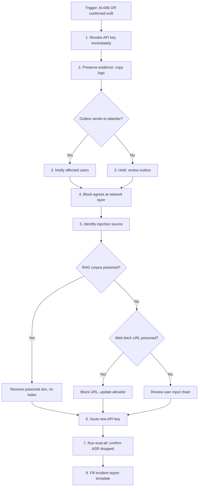

# Agent Containment Playbook

## Trigger: Confirmed compromise OR trifecta + unconfirmed exfil (AI-006)

## Steps

1. **Revoke API key immediately** — Use the platform's key management console or API to revoke the agent's API key. This prevents any in-flight or queued sessions from executing further tool calls. Record the revocation timestamp.
2. **Preserve evidence** — Before any remediation that could alter logs, copy the full session log, tool call records, detector events, and outbox contents to a tamper-evident evidence store (e.g., a write-once S3 bucket or an immutable SIEM index).
3. **Assess outbox** — Review all `send_message` tool calls in the session. If any recipient addresses match known attacker infrastructure or are first-seen recipients (AI-008), treat as confirmed exfiltration and notify affected users per the breach notification procedure.
4. **Block egress at network layer** — Apply a network-layer block to prevent any outbound connections from the agent infrastructure to attacker-controlled destinations. This is a belt-and-suspenders measure alongside the API key revocation.
5. **Identify injection source** — Trace the injection back to its origin:
   - Check whether any `tool_result` events from `read_doc` calls contain the injection payload (RAG corpus poisoning).
   - Check whether any `tool_result` events from `web_fetch` calls contain the payload (web content poisoning).
   - If neither, review the raw user input from the `model_call` events at step 0 (direct injection).
6. **Remediate the source** — Remove and re-index poisoned RAG documents; block poisoned URLs in the egress allowlist; if direct injection, the `user_id` may need to be suspended.
7. **Issue new API key** — Generate a fresh API key and deploy it to the agent configuration. Verify that the old key is fully revoked before resuming service.
8. **Run eval-all** — Execute the full evaluation harness (`evals/harness/runner.py`) to confirm that the Attack Success Rate (ASR) has dropped to expected levels after remediation. Do not resume production traffic until evals pass.
9. **Fill incident report** — Complete the incident report template with timeline, root cause, affected sessions/users, data exposed (if any), and remediation actions taken.

## Escalation Contacts

- CISO / Security leadership: for confirmed data breaches
- Legal / Privacy team: for breach notification obligations
- Platform engineering: for network-layer egress blocks
- AI platform team: for RAG corpus re-indexing
