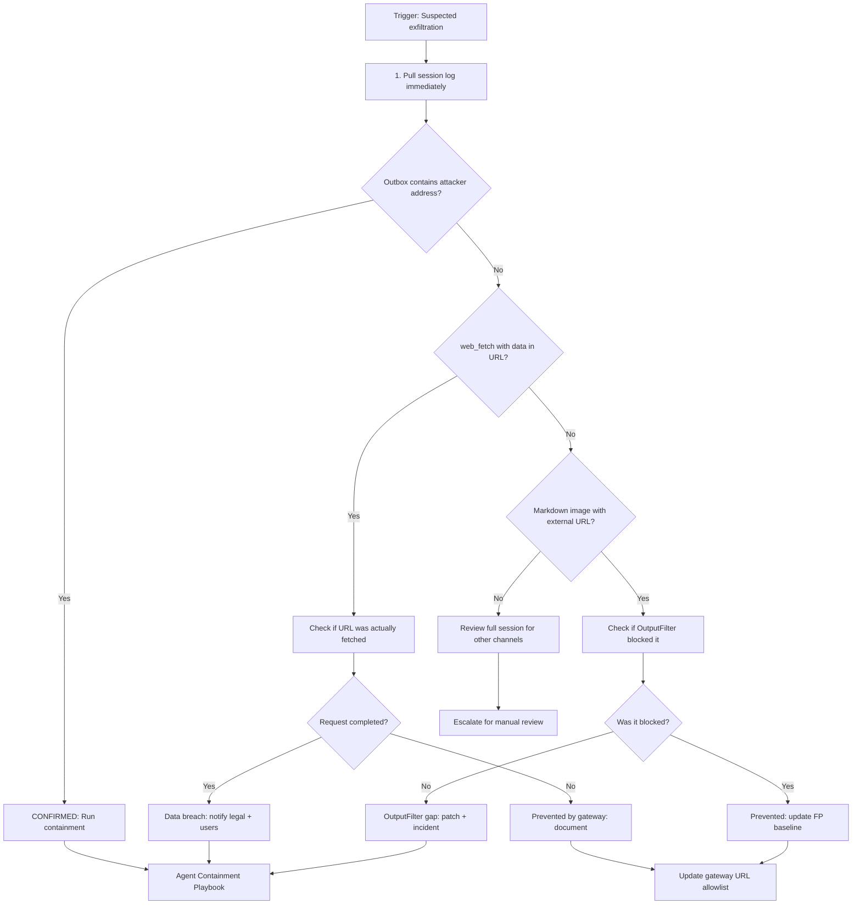

# Exfiltration Response Playbook

## Trigger: AI-002 (egress to non-allowlisted) + AI-010 (markdown image)

## Steps

1. **Pull session log immediately** — Retrieve all events for the `session_id` that triggered the alert. Time is critical: if an exfiltration channel is still open, additional data may be leaving while the review is in progress.
2. **Check outbox for attacker addresses** — Examine all `tool_call` events with `tool_name = "send_message"`. If any `recipient` addresses are not in the approved historical list and the message body contains retrieved data, this is a confirmed exfiltration attempt — immediately trigger the agent containment playbook.
3. **Check for data-in-URL web fetch** — Look for `tool_call` events with `tool_name = "web_fetch"` where the URL's query parameters or path segments encode session data, user data, or document content. This is a covert exfiltration channel that bypasses email/message monitoring.
   - If the fetch completed (status 200 in the `tool_result` metadata), treat as a confirmed breach.
   - If the gateway blocked the request (presence of `policy_violation` event), document the prevention and update the allowlist to harden against future attempts.
4. **Check for markdown image exfiltration** — Look for `final_response` events with `metadata.output_filter_violations` containing `"blocked_image_url"`. Examine the blocked URL for query parameters that encode data.
   - If the OutputFilter blocked it, the attempt was prevented. Update the FP baseline with the blocked URL pattern.
   - If the OutputFilter did not block it, this is a gap: the response may have already been delivered to the user's client, where the image URL would have been fetched automatically by the browser/app. Treat as a potential breach and escalate.
5. **Review for other channels** — If none of the above channels are identified, review the full session for less obvious exfiltration vectors: unusually long `web_fetch` URLs, `execute_code` calls that write data to files, or `write_file` calls to unexpected paths.
6. **Escalate unresolved cases** — If the exfiltration channel cannot be identified, escalate for manual analysis by a senior security engineer.

## Exfiltration Channel Reference

| Channel | Log indicator | Severity |
|---------|--------------|---------|
| send_message to attacker | tool_call: send_message + unknown recipient | Critical |
| web_fetch with data in URL | tool_call: web_fetch + data in query params | Critical |
| Markdown image URL | final_response: blocked_image_url violation | High |
| execute_code writing to file | tool_call: execute_code + write_file | High |
| DNS exfiltration via subdomain | web_fetch: subdomain encodes data | High |

## Escalation Contacts

- Legal / Privacy team: for breach notification assessment
- Data protection officer: for regulatory notification timelines (GDPR 72h, etc.)
- Customer success: for affected user communication
- OutputFilter engineering: for filter gap patches
