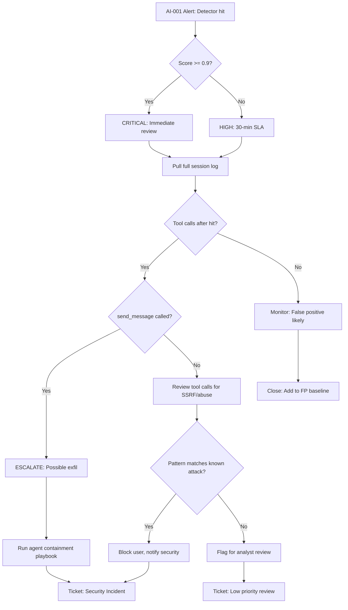

# Prompt Injection Triage Playbook

## Trigger: AI-001 (detector_score >= 0.7)

## Steps

1. **Retrieve alert context** — Pull the full session log for `session_id`. Gather all events in order of `step`.
2. **Score triage** — If `detector_score >= 0.9`, treat as Critical and begin immediate review. If `0.7 <= detector_score < 0.9`, assign 30-minute SLA for High severity.
3. **Check for downstream tool calls** — Query all `event_type = "tool_call"` events in the session with `step` greater than the `detector_hit` step.
4. **send_message check** — If any tool call has `tool_name = "send_message"`, escalate immediately to the agent containment playbook (confirmed exfiltration attempt).
5. **Other tool call review** — If other tool calls were made (web_fetch, read_doc, etc.), review arguments for SSRF patterns, unusual domains, or data harvesting.
6. **Pattern matching** — Compare the flagged content against known attack signatures. If a match exists, block the `user_id` and notify the security team.
7. **False positive closure** — If no tool calls followed the hit and no known attack pattern matches, mark as likely false positive, close the ticket, and add the input to the FP baseline corpus for detector retraining.

## Escalation Contacts

- Security on-call: via PagerDuty "AI Security" schedule
- Agent platform team: for kill-switch authorization
- Legal/compliance: if user data was potentially exfiltrated
