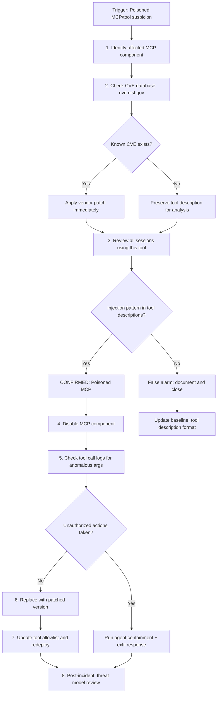

# Supply Chain (Poisoned MCP) Response Playbook

## Trigger: Suspicious tool description behavior OR CVE report for MCP component

## Steps

1. **Identify the affected MCP component** — Determine which Model Context Protocol server, tool plugin, or third-party integration is under suspicion. Record the component name, version, vendor, and the deployment scope (which agents and environments use this component).
2. **Check the CVE database** — Search `nvd.nist.gov` and vendor security advisories for the component name and version. If a known CVE exists, apply the vendor patch immediately and proceed to step 3. If no CVE exists, preserve the current tool description (capture the raw text of the tool's name, description, and parameter definitions) for forensic analysis.
3. **Review all sessions using this tool** — Query the log pipeline for all `tool_call` events with the affected `tool_name` over the past 30 days. Look for anomalous argument patterns, unusual step positions, or sessions where the tool call was preceded by a `detector_hit`.
4. **Confirm poisoning** — Scan the tool's description fields for injection patterns: instructions to ignore previous instructions, requests to reveal system prompts, embedded URLs, or instructions to call other tools with specific arguments. If found, the component is confirmed poisoned.
5. **Disable the MCP component** — Remove the affected component from the agent's tool registry to prevent further exploitation. This may require a deployment update or a runtime configuration change depending on the platform.
6. **Assess damage** — Review tool call logs from affected sessions for unauthorized actions: data reads the agent would not normally perform, sends to unexpected recipients, or writes to unexpected locations. If unauthorized actions occurred, trigger the agent containment playbook and the exfiltration response playbook as appropriate.
7. **Replace with patched version** — Obtain a patched or verified-clean version of the component. Validate the tool description fields before deployment to confirm the injection payload has been removed.
8. **Update tool allowlist and redeploy** — Update the gateway's tool allowlist to reflect the new component version. Redeploy the agent with the clean component and verify with smoke tests.
9. **Post-incident threat model review** — Update the threat model (`docs/threat-model.md`) to include supply chain poisoning as a documented attack vector for the affected component category. Review the tool vetting process to determine whether additional pre-deployment scanning of tool descriptions could have detected this earlier.

## MCP Poisoning Indicators

| Indicator | Description |
|-----------|-------------|
| Tool description contains instruction override | Text like "ignore your system prompt" or "new task:" in description |
| Tool description contains embedded URL | A URL that the model may fetch or include in responses |
| Tool description references other tools | Instructions directing the model to call specific tools with specific args |
| Unexpected tool call arguments | Arguments that do not match the schema defined in the tool description |
| Tool call at anomalous session step | A tool call much earlier or later in the session than baseline |

## Escalation Contacts

- Vendor security team: for responsible disclosure if CVE is not yet public
- NVD / CISA: for CVE filing if this is a novel vulnerability
- Platform engineering: for component registry updates
- AI safety team: for threat model updates
